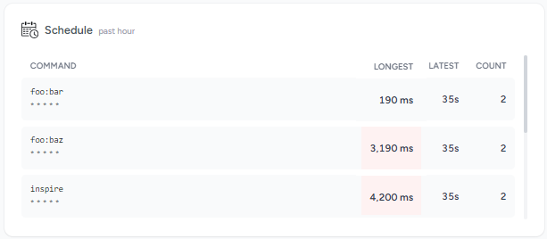
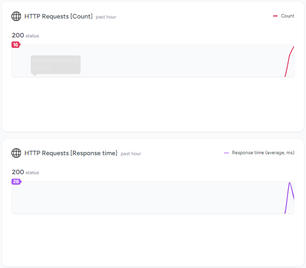
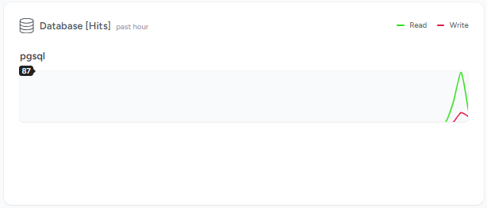
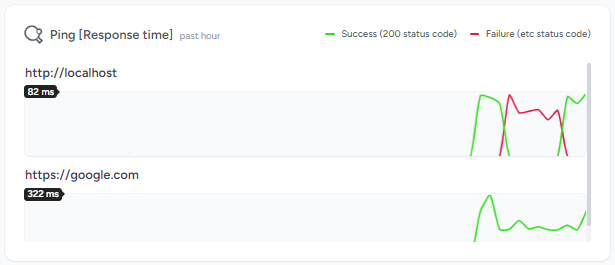
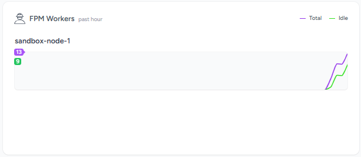
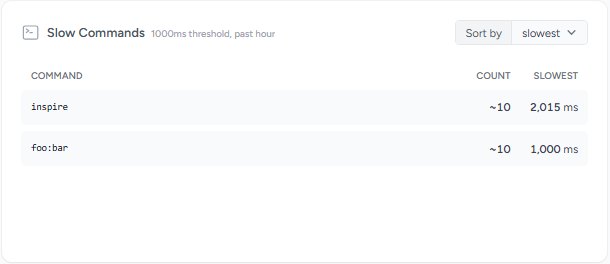

# Additional cards for Laravel Pulse

## Installation

```bash
composer require anourvalar/laravel-pulse
```


## Schedule (cron)



Add recorder to the config/pulse.php:

```php
AnourValar\LaravelPulse\Recorders\ScheduleRecorder::class => [
    'enabled' => env('PULSE_ANOURVALAR_SCHEDULE_ENABLED', true),
    'sample_rate' => env('PULSE_ANOURVALAR_SCHEDULE_SAMPLE_RATE', 1),
    'ignore' => [],
],
```

Add card to the vendor/pulse/dashboard.blade.php:

```html
<livewire:anourvalar.pulse.schedule cols="6" />
```


## HTTP Requests (count & response time)



Add recorder to the config/pulse.php:

```php
AnourValar\LaravelPulse\Recorders\HttpRequestsRecorder::class => [
    'enabled' => env('PULSE_ANOURVALAR_HTTP_REQUESTS_ENABLED', true),
    'sample_rate' => env('PULSE_ANOURVALAR_HTTP_REQUESTS_SAMPLE_RATE', 1),
    'ignore' => ['#/admin/#', '#/livewire/#'],
],
```

Add cards to the vendor/pulse/dashboard.blade.php:

```html
<livewire:anourvalar.pulse.http-requests-count cols="6" />
<livewire:anourvalar.pulse.http-requests-avg cols="6" />
```

Optionally: To record the latency between the web server and the PHP worker, configure your web server to add a timestamp header:

```
fastcgi_param HTTP_X_REQUEST_START $msec; # fpm
proxy_set_header X-Request-Start $msec; # octane
```


## Database (queries)



Add recorder to the config/pulse.php:

```php
AnourValar\LaravelPulse\Recorders\DatabaseRecorder::class => [
    'enabled' => env('PULSE_ANOURVALAR_DATABASE_ENABLED', true),
    'sample_rate' => env('PULSE_ANOURVALAR_DATABASE_SAMPLE_RATE', 1),
    'ignore' => ['#pulse_#'],
],
```

Add card to the vendor/pulse/dashboard.blade.php:

```html
<livewire:anourvalar.pulse.database cols="6" />
```


## Ping (Response time & status code)



Add recorder to the config/pulse.php:

```php
AnourValar\LaravelPulse\Recorders\PingRecorder::class => [
    'enabled' => env('PULSE_ANOURVALAR_PING_ENABLED', true),
    'urls' => ['/'],
],
```

Add card to the vendor/pulse/dashboard.blade.php:

```html
<livewire:anourvalar.pulse.ping cols="6" />
```


## FPM (Workers count)



Add recorder to the config/pulse.php:

```php
AnourValar\LaravelPulse\Recorders\FpmRecorder::class => [
    'enabled' => env('PULSE_ANOURVALAR_FPM_ENABLED', true),
    'sample_rate' => env('PULSE_ANOURVALAR_FPM_SAMPLE_RATE', 1),
],
```

Add card to the vendor/pulse/dashboard.blade.php:

```html
<livewire:anourvalar.pulse.fpm cols="6" />
```


## Slow Commands



Add recorder to the config/pulse.php:

```php
AnourValar\LaravelPulse\Recorders\SlowCommandsRecorder::class => [
    'enabled' => env('PULSE_ANOURVALAR_SLOW_COMMANDS_ENABLED', true),
    'sample_rate' => env('PULSE_ANOURVALAR_SLOW_COMMANDS_SAMPLE_RATE', 1),
    'threshold' => env('PULSE_ANOURVALAR_SLOW_COMMANDS_THRESHOLD', 1000),
    'ignore' => ['#^tinker#', '#^schedule\:#', '#^horizon\:#', '#invoke\-serialized\-closure#'],
],
```

Add card to the vendor/pulse/dashboard.blade.php:

```html
<livewire:anourvalar.pulse.slow-commands cols="6" />
```


## Latency Jobs


Add recorder to the config/pulse.php:

```php
AnourValar\LaravelPulse\Recorders\LatencyJobsRecorder::class => [
    'enabled' => env('PULSE_ANOURVALAR_LATENCY_JOBS_ENABLED', true),
    'sample_rate' => env('PULSE_ANOURVALAR_LATENCY_JOBS_SAMPLE_RATE', 1),
    'threshold' => env('PULSE_ANOURVALAR_LATENCY_JOBS_THRESHOLD', 10000),
    'ignore' => ['#pulse#'],
],
```

Add card to the vendor/pulse/dashboard.blade.php:

```html
<livewire:anourvalar.pulse.latency-jobs cols="6" />
```
